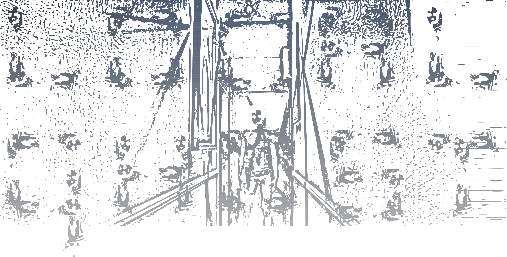

<!-- <h1 align="center">localghost</h1> -->

<br />

<div align="center">
  
</div>

<div align="center">
  <strong>
    Safe Rust bindings to the Web platform.
  </strong>
</div>

<br />

<div align="center">
  <!-- Crates version -->
  <a href="https://crates.io/crates/localghost">
    
  </a>
  <!-- Downloads -->
  <a href="https://crates.io/crates/localghost">
    
  </a>
  <!-- docs.rs docs -->
  <a href="https://docs.rs/localghost">
    
  </a>
</div>

<br />

<div align="center">
  <h3>
    <a href="https://mild.zulipchat.com/join/kzqeclaausblt3ixgj5crexf">
      Chat
    </a>
    <span> | </span>
    <a href="https://docs.rs/localghost">
      API Docs
    </a>
    <span> | </span>
    <a href="https://github.com/yoshuawuyts/localghost/releases">
      Releases
    </a>
    <span> | </span>
    <a href="https://github.com/yoshuawuyts/localghost/blob/master.github/CONTRIBUTING.md">
      Contributing
    </a>
  </h3>
</div>

## Installation
```sh
$ cargo add localghost
```

## Safety
This crate makes limited use of `unsafe`.

## Contributing
Want to join us? Check out our ["Contributing" guide][contributing] and take a
look at some of these issues:

- [Issues labeled "good first issue"][good-first-issue]
- [Issues labeled "help wanted"][help-wanted]

[contributing]: https://github.com/yoshuawuyts/localghost/blob/master.github/CONTRIBUTING.md
[good-first-issue]: https://github.com/yoshuawuyts/localghost/labels/good%20first%20issue
[help-wanted]: https://github.com/yoshuawuyts/localghost/labels/help%20wanted

## License

<sup>
Licensed under either of <a href="LICENSE-APACHE">Apache License, Version
2.0</a> or <a href="LICENSE-MIT">MIT license</a> at your option.
</sup>

<br/>

<sub>
Unless you explicitly state otherwise, any contribution intentionally submitted
for inclusion in this crate by you, as defined in the Apache-2.0 license, shall
be dual licensed as above, without any additional terms or conditions.
</sub>
